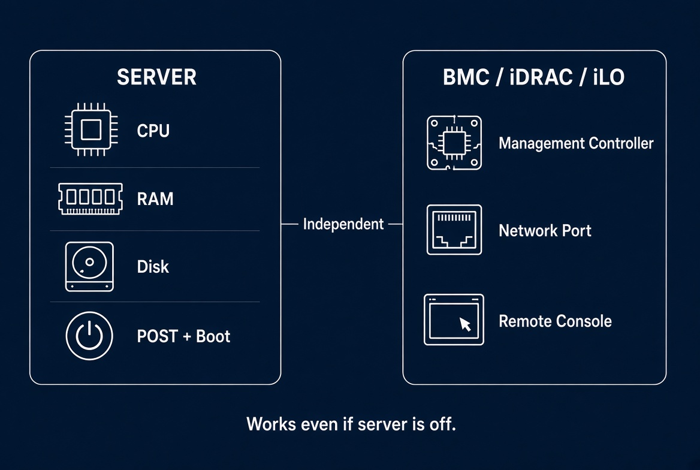
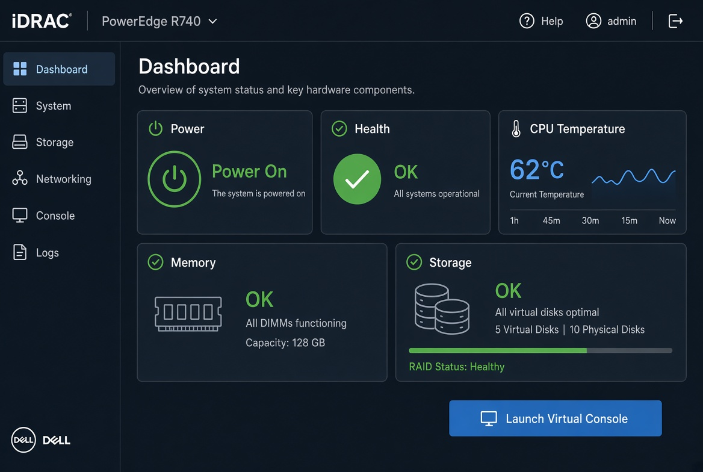
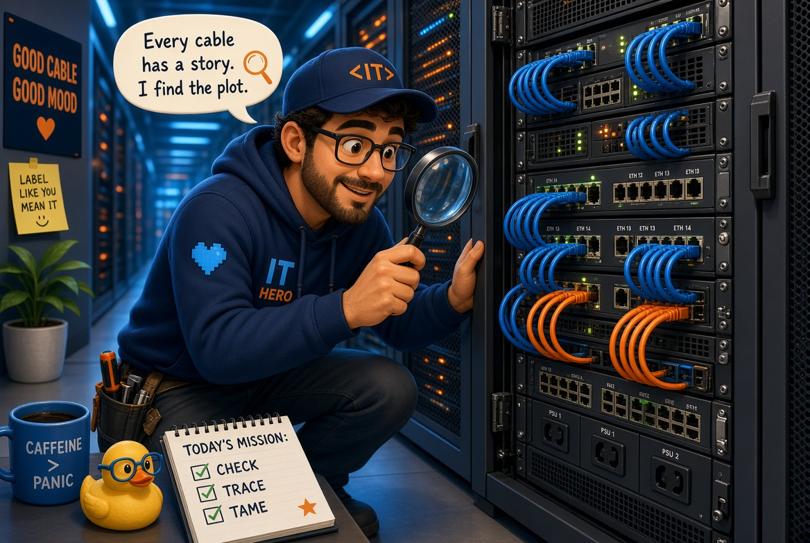

Lors d’un échange technique récent, nous avons clarifié un point souvent confondu : la différence entre POST et Boot, et ce que cela implique réellement en environnement datacenter.

( La confusion 😅 : https://fr.wikipedia.org/wiki/Post_(informatique) peux  etre interprété plus expliecitement en  DataCenter ).


### Visualisation ultra-simple

1. **POST**  
   = Le test matériel  
   « Est-ce que le hardware fonctionne ? »

2. **Boot**  
   = Le démarrage du système  
   « Je charge maintenant le système d’exploitation »

### L’ordre exact :

```
Allumage (Power On)
        ↓
     POST          ← test du hardware (fait par le BIOS/UEFI)
        ↓
     Boot          ← chargement de l’OS (Windows, Linux, etc.)
```

Le **POST** doit réussir **avant** que le **Boot** puisse commencer.

Si le POST échoue → la machine ne boot pas.  
Si le POST réussit → le système passe au Boot.

Donc non, ce n’est pas « tout le POST ».  
Ce sont bien **deux phases différentes** qui se suivent.


### Ce qui change en datacenter

Sur les serveurs (surtout ceux qu’on trouve chez AWS, Dell, HPE, etc.),🧐 il existe une carte de management séparée :

- **BMC** (Baseboard Management Controller)
- **iDRAC** (Dell)
- **iLO** (HPE)
- **IPMI / Redfish**

Ces cartes :
- Fonctionnent **même si le serveur est éteint ou en train de booter**
- Ont leur propre réseau
- Peuvent surveiller le hardware en temps réel (températures, ventilateurs, alimentation, erreurs mémoire, etc.)
- Permettent le diagnostic et le contrôle à distance


### Explication claire et simple :

Dans un serveur pro, il y a **deux cerveaux** :

1. **Le serveur lui-même** (processeur, RAM, disques…) → c’est ce que le POST et le Boot concernent.
2. **Une petite carte de management indépendante** (le BMC) → elle a son propre processeur, sa propre mémoire, et souvent sa propre prise réseau.



Cette carte permet de :
- Allumer / éteindre / redémarrer le serveur à distance
- Voir l’état du hardware même si le serveur est planté ou éteint
- Consulter les logs, températures, alimentations, etc.
- Monter une image ISO à distance
- Prendre la main sur la console (KVM distant)

### Les noms selon les constructeurs :

| Constructeur | Nom de la solution          |
|--------------|-----------------------------|
| **Dell**     | iDRAC                       |
| **HPE**      | iLO                         |
| **Générique**| BMC (Baseboard Management Controller) |

### Les protocoles

- **IPMI** → l’ancien standard (encore très présent)
- **Redfish** → le standard moderne (API REST, plus propre, plus sécurisé, plus simple à automatiser)

**Redfish** = la façon moderne de parler à ces cartes de management.  
C’est une API (comme un site web technique) qui permet de piloter et superviser les serveurs de façon standardisée.

### Pourquoi c’est important pour un Data Center Technician :

Chez AWS OVH, Equinix, etc..., une grande partie du travail se fait **via ces interfaces de management** :
- Diagnostiquer un serveur qui ne démarre plus
- Remplacer un disque / une alimentation
- Vérifier les alertes hardware
- Faire du provisionnement

### Monitoring
Zabbix, Prometheus, etc... dans tout ça ?

Zabbix = outil de **supervision** (monitoring) qui tourne **une fois que le système est démarré**.

- Il a besoin que la machine soit allumée et que l’agent (ou le protocole) soit accessible.
- Il ne remplace pas le POST.
- Il vient **après**.

### Résumé clair :

| Niveau              | Outil / Mécanisme          | Quand ça agit          | Accès distant |
|---------------------|----------------------------|------------------------|---------------|
| Très bas niveau     | POST (BIOS/UEFI)           | Juste après l’allumage | Non           |
| Hardware distant    | BMC / iDRAC / iLO / Redfish| Même machine éteinte   | Oui           |
| Système démarré     | Zabbix, Prometheus, etc.   | Une fois l’OS up       | Oui           |

---
###Reprenons
---
### 1. POST
C’est **toujours** le processus de démarrage **d’une machine individuelle** (PC de maison ou serveur dans un rack).  
Il se passe localement, au niveau du firmware de **cette** machine.  
Que ce soit un seul serveur ou 10 000 serveurs dans un datacenter, chaque machine fait son propre POST.

---

### 2. Peut-on brancher un agent sur le BMC

**Oui**, mais pas un agent classique comme sur un Linux normal.

Le BMC (iDRAC, iLO, etc.) est déjà une petite machine indépendante.  
On ne « branche » pas un agent dessus comme on le ferait sur un serveur Linux.  
Par contre, on **interroge** le BMC depuis l’extérieur avec des outils de monitoring.

---

### 3. Est-ce que des outils existent déjà

🧐
**Oui, et depuis longtemps.** C’est même le standard en datacenter.

Exemples concrets :

| Outil / Approche              | Ce qu’il fait |
|-------------------------------|---------------|
| **IPMI / Redfish**            | Protocoles pour parler au BMC |
| **iDRAC / iLO interface web** | Interface native du constructeur |
| **Zabbix + IPMI/Redfish**     | Supervision centralisée des serveurs via le BMC |
| **Prometheus + exporters**    | Collecte de métriques hardware |
| **Nagios / Checkmk**          | Anciens mais encore utilisés |
| **Outils constructeurs**      | Dell OpenManage, HPE OneView, etc. |
| **Solutions datacenter**      | DCIM (Data Center Infrastructure Management) |

Dans un vrai datacenter (surtout chez AWS, OVH, Equinix, etc.), on ne regarde presque jamais le POST « à la main ».  
On supervise **en masse** via les BMC + une plateforme de monitoring centralisée.


---

### 4. Comment un technicien utilise iDRAC ou iLO au quotidien

🧰
Imaginons que tu es en datacenter (ou en remote) et qu’un serveur pose problème. Voici ce que tu fais vraiment :

**1. Tu te connectes à l’interface de management**
- Tu ouvres un navigateur
- Tu vas sur l’IP du **iDRAC** (Dell) ou de l’**iLO** (HPE)
- Tu te connectes avec tes identifiants

Là tu arrives sur un tableau de bord qui te montre l’état de la machine **même si elle est éteinte ou plantée**.

**2. Ce que tu regardes en premier**
- Est-ce que le serveur est allumé ou éteint ?
- Y a-t-il des alertes hardware (disque, alimentation, température, mémoire…) ?
- Les logs d’événements (System Event Log)
- L’état des ventilateurs, des alimentations, de la RAM, des disques

**3. Actions courantes d’un technicien**
- Allumer / éteindre / redémarrer le serveur à distance
- Prendre la main sur la console (KVM distant) → tu vois l’écran du serveur comme si tu étais devant
- Monter une ISO (pour réinstaller un système par exemple)
- Voir les codes d’erreur POST
- Mettre à jour le firmware (BIOS, iDRAC/iLO, cartes réseau, etc.)
- Diagnostiquer un disque en erreur ou une alimentation HS

**Exemple concret de journée :**
Un serveur ne répond plus.
→ Tu te connectes à l’iDRAC/iLO  
→ Tu vois qu’il est allumé mais qu’il y a une alerte disque  
→ Tu regardes les logs  
→ Tu redémarres proprement ou tu lances un diagnostic  
→ Si besoin, tu ouvres la console distante pour voir ce qui s’affiche à l’écran (message d’erreur, POST qui bloque, etc.)


---

### 5. Est-ce qu'on peut rentrer dans le BIOS ou UEFI avec iDRAC ou iLO

🤓
**Oui.**

C’est même l’un des gros intérêts :

- Tu redémarres le serveur via l’interface
- Pendant le démarrage, tu ouvres la **console distante** (Virtual Console / Remote Console)
- Tu appuies sur la touche pour entrer dans le BIOS/UEFI (F2, Del, F10… selon le serveur)
- Tu navigues dans le BIOS **à distance**, comme si tu avais un clavier et un écran branchés sur la machine

Tu peux donc :
- Modifier les settings BIOS
- Changer l’ordre de boot
- Activer/désactiver des options
- Faire du troubleshooting bas niveau

Tout ça **sans être physiquement devant le serveur**.

---

### Résumé terrain

| Action                        | Possible avec iDRAC / iLO ? |
|-------------------------------|-----------------------------|
| Voir l’état hardware          | Oui                        |
| Allumer / éteindre à distance | Oui                        |
| Voir les logs et alertes      | Oui                        |
| Prendre la main sur l’écran   | Oui (console distante)     |
| Entrer dans le BIOS/UEFI      | Oui                        |
| Monter une ISO                | Oui                        |
| Diagnostiquer un POST qui bloque | Oui                     |

C’est pour ça que ces outils sont **centraux** dans le métier de Data Center Technician.

---


### 6. Scénario typique : serveur qui ne boot plus

**Contexte :**  
Un serveur en production ne répond plus. Les monitoring (Zabbix ou autre) montrent qu’il est injoignable. On te demande d’intervenir.

---

### Étape 1 — Connexion au management
- Tu ouvres ton navigateur
- Tu te connectes à l’**iDRAC** (Dell) ou **iLO** (HPE) du serveur concerné
- Tu arrives sur le tableau de bord

### Étape 2 — Premier diagnostic rapide
Tu regardes immédiatement :
- Le serveur est-il **allumé** ou **éteint** ?
- Y a-t-il des **alertes rouges** (disque, alimentation, température, mémoire…) ?
- Dans les logs (System Event Log / IML), quelles sont les dernières erreurs ?

**Cas fréquent :**  
Tu vois une alerte « Drive Predictive Failure » ou « Power Supply Failed » ou « Memory Uncorrectable Error ».

### Étape 3 — Console distante
- Tu lances la **Virtual Console** / **Remote Console**
- Tu vois ce qui s’affiche à l’écran du serveur

**Possibilités classiques :**
- Écran noir
- Message d’erreur POST
- Boucle de reboot
- Message « No boot device » / « Boot failure »
- Le serveur est bloqué sur un code d’erreur

### Étape 4 — Actions selon ce que tu vois

**Si le serveur est éteint :**
→ Tu l’allumes via iDRAC/iLO et tu observes le POST en direct dans la console.

**Si le POST bloque ou affiche une erreur :**
→ Tu notes le code d’erreur / le message  
→ Tu regardes dans les logs hardware  
→ Tu identifies le composant en cause (RAM, disque, alimentation, carte mère…)

**Si le POST passe mais le système ne boot pas :**
→ Tu redémarres et tu entres dans le **BIOS/UEFI** via la console distante  
→ Tu vérifies l’ordre de boot  
→ Tu vérifies si le disque système est bien détecté

**Si un disque est en erreur :**
→ Tu confirmes lequel via iDRAC/iLO  
→ Tu lances éventuellement un diagnostic  
→ Tu prépares le remplacement (selon les procédures du datacenter)

### Étape 5 — Escalade ou résolution
- Si c’est un problème simple (disque, alimentation, ordre de boot) → tu traites
- Si c’est plus profond (carte mère, CPU, problème récurrent) → tu documentes et tu escalades

---

### Ce que nous faisons dans ce scénario :
- Nous n'avons **pas** eu besoin d’être physiquement devant le serveur
- Nous avons diagnostiqué à distance grâce au BMC (iDRAC/iLO)
- Nous avons pu voir le POST, entrer dans le BIOS, et identifier la panne

C’est exactement le genre de situation qu’un Data Center Technician gère régulièrement. 🦾​
